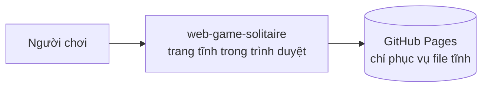
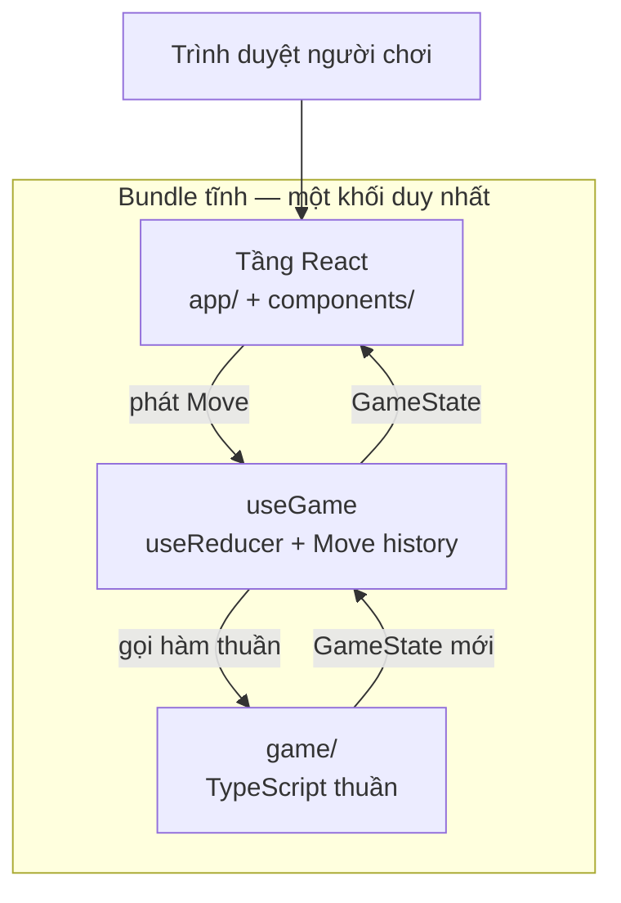

# Kiến trúc

> **Trả lời:** Hệ thống ghép lại thế nào, ranh giới giữa các phần ở đâu?
> **Trạng thái:** 🟢 đủ
> **Cập nhật:** 2026-09-04 · commit —
> **Cập nhật khi:** thêm/bỏ một module hoặc service · đổi cách hai module nói chuyện

## 1. Context — hệ thống nằm giữa ai với ai

Không có hệ thống ngoài nào khác. Không API, không datastore, không dịch vụ bên thứ ba — kể cả font cũng nằm trong bundle. Đây là hệ quả trực tiếp của trần chi phí 0 đ trong [`overview.md`](../01-product/overview.md) §5.

## 2. Container — hệ thống gồm những khối chạy được nào

Chỉ có **một** khối chạy được. Không worker, không service worker, không tiến trình nền.

## 3. Module và ranh giới

| Module | Trách nhiệm một câu | Được phép gọi | **Không** được gọi |
| --- | --- | --- | --- |
| `game/cards.ts` | Định nghĩa lá bài, chất, hạng, màu, và bộ 52 lá chuẩn | — | mọi module khác |
| `game/rng.ts` | PRNG có seed (mulberry32) và phép xáo Fisher–Yates xác định | — | `Math.random` |
| `game/state.ts` | Kiểu `GameState`, `PileId` và các hàm đọc thuần tuý | `cards` | `moves`, `auto` |
| `game/deal.ts` | Từ seed và chế độ rút, dựng thế bài đầu ván | `cards`, `rng`, `state` | `moves` |
| `game/moves.ts` | `Move`, `isLegal`, `applyMove`, `legalMoves` — **nguồn duy nhất của luật** | `state`, `cards` | React, DOM, `auto` |
| `game/auto.ts` | Tìm đích tự động cho một lá; sinh chuỗi nước dọn cuối ván | `moves`, `state` | React, DOM |
| `hooks/useGame.ts` | Giữ seed + `Move[]`, thực thi dispatch/undo/newGame/restart | toàn bộ `game/` | DOM trực tiếp |
| `hooks/useSelection.ts` | Gom chạm và kéo thành một `MoveIntent` duy nhất | `state`, `useGame` | `applyMove` |
| `components/*` | Vẽ bàn bài và bắt sự kiện; dựng `Move` rồi phát đi | `hooks`, `state`, `lib/strings` | `applyMove`, `game/moves` |
| `lib/strings.ts` | Toàn bộ chuỗi tiếng Việt hiển thị | — | — |

Ranh giới quan trọng nhất là dòng kẻ giữa `game/` và mọi thứ còn lại: **luật đi xuống, dữ liệu đi lên, không có mũi tên ngược.** Ba bất biến đầu trong [`invariants.md`](invariants.md) tồn tại chỉ để canh dòng kẻ này.

Component **không** được import `game/moves.ts`. Nó chỉ mô tả ý định ("người chơi muốn đưa dãy này sang cột kia") và để `useGame` phán quyết. Không có ranh giới đó thì luật sẽ rò rỉ dần vào handler sự kiện, và tap với drag sẽ tách thành hai bộ luật.

## 4. Luồng dữ liệu của đường đi quan trọng nhất

Một nước đi, đi từ ngón tay đến pixel:

1. `CardView` nhận `pointerdown`/`click`/`keydown` và báo lên `useSelection` — chỉ toạ độ và danh tính chồng bài, không có phán xét nào về luật.
2. `useSelection` gom trạng thái cử chỉ (đang chọn gì, đang kéo gì) và khi có đủ nguồn + đích thì dựng một `Move`.
3. `useGame` nhận `Move`, hỏi `isLegal`. **Không hợp lệ thì dừng ở đây** — bỏ lựa chọn, báo hiệu nháy đỏ, và `history` không đổi (bất biến 7).
4. Hợp lệ thì `Move` được nối vào `history`, và state mới = `applyMove(state, move)`.
5. React vẽ lại từ `GameState` mới. Vì mỗi lá giữ `id` ổn định làm `key`, trình duyệt tự nội suy vị trí cũ sang mới bằng CSS transition — không có hệ animation riêng.
6. Sau mỗi lần đổi state, `useGame` kiểm điều kiện thắng và điều kiện hiện nút **Hoàn tất**.

Undo đi ngược đúng con đường đó, nhưng không có bước lùi nào: bỏ phần tử cuối của `history`, chia lại từ seed, rồi phát lại toàn bộ. Xem [`ADR-0001`](../decisions/0001-seed-va-undo-bang-phat-lai.md).

## 5. Tech stack

| Lớp | Công nghệ | Biện minh |
| --- | --- | --- |
| Framework | Next.js 15 (App Router, `output: 'export'`) | ADR-0004 |
| UI | React 19 + TypeScript 5 | ADR-0004 |
| Style | Tailwind CSS 3 | ADR-0004 |
| Icon | lucide-react | ADR-0004 |
| Vẽ bài | DOM + CSS transition | ADR-0003 |
| Màn mừng thắng | Canvas 2D phủ lên | ADR-0003 |
| Test luật | Vitest + happy-dom | ADR-0004 |
| Test đầu-cuối | Playwright | ADR-0004 |
| Quản lý gói | Yarn classic | ADR-0004 |
| Triển khai | GitHub Pages, file tĩnh | ADR-0004 |
